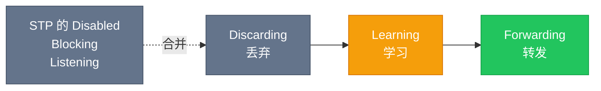
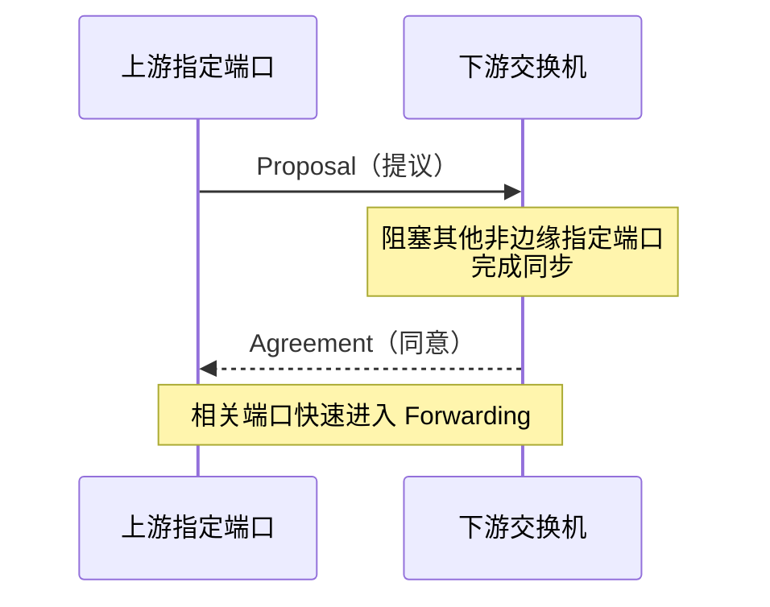

> [!NOTE] 一句话理解
> **生成树的本质：物理链路保留冗余，逻辑转发保持无环。** 正常情况下阻塞一部分链路；主链路故障后，再让备用链路接替转发。

本文将从三个问题展开：

- 为什么二层网络需要生成树？
- STP 与 RSTP 的收敛机制有什么区别？
- 根保护、BPDU 保护和 TC 保护应该部署在哪里？

## 为什么需要生成树

在二层交换网络中，为了提高可靠性，交换机之间通常会部署冗余链路。但二层以太网帧没有类似 IP 数据包中 TTL 的机制，如果所有冗余链路同时转发流量，可能产生广播风暴、MAC 地址表漂移和重复帧等问题。

生成树协议（Spanning Tree Protocol，STP）通过逻辑阻塞部分冗余链路，将存在环路的物理拓扑裁剪成一棵无环的逻辑树。当正在使用的链路发生故障时，被阻塞的冗余链路可以重新参与计算并恢复转发。


> [!WARNING] 没有生成树会发生什么？
> 广播帧可能在环路中不断复制，交换机反复学习同一 MAC 地址，最终出现**广播风暴、MAC 地址漂移和重复帧**，严重时会导致整个二层网络不可用。

## STP 的选举过程

STP 通过交换 BPDU（Bridge Protocol Data Unit，网桥协议数据单元）选举根桥并计算无环路径。其基本过程如下：

1. **选举根桥（Root Bridge）**：Bridge ID 最小的交换机成为根桥。Bridge ID 由桥优先级和 MAC 地址组成，优先比较优先级，越小越优。
2. **选举根端口（Root Port，RP）**：每台非根桥上，到达根桥路径开销最小的端口成为根端口。每台非根桥通常只有一个根端口。
3. **选举指定端口（Designated Port，DP）**：每个二层网段上，到达根桥路径最优的端口成为该网段的指定端口。根桥上的活动端口通常都是指定端口，但指定端口并不只存在于根桥上。
4. **阻塞其他端口**：既不是根端口也不是指定端口的端口进入阻塞状态，从而消除二层环路。


> [!TIP] 记忆顺序
> **先选根桥，再选根端口，然后选指定端口，最后阻塞剩余端口。**

> [!NOTE] 关于“备用根桥”
> STP 标准本身没有单独定义“备份根桥”这一运行角色，但工程中可以通过设置次低优先级，预先指定一台交换机作为备用根桥。

## 传统 STP 的五种端口状态

IEEE 802.1D STP 定义了五种端口状态：

| 状态 | 是否转发数据 | 是否学习 MAC | 说明 |
| --- | --- | --- | --- |
| Disabled（禁用） | 否 | 否 | 端口关闭，或没有参与生成树计算 |
| Blocking（阻塞） | 否 | 否 | 接收并处理 BPDU，但不转发普通数据帧 |
| Listening（侦听） | 否 | 否 | 参与生成树计算，等待拓扑稳定，默认持续 15 秒 |
| Learning（学习） | 否 | 是 | 开始学习源 MAC 地址，默认持续 15 秒 |
| Forwarding（转发） | 是 | 是 | 正常转发数据帧并学习 MAC 地址 |


传统 STP 的端口从阻塞状态恢复到转发状态，通常需要经历 Listening 和 Learning 两个阶段，默认共约 30 秒。

如果故障不能由端口物理状态直接感知，交换机还需要等待旧 BPDU 信息老化。默认 Max Age 为 20 秒，因此极端情况下收敛时间可能达到约 50 秒：

```text
20 秒（等待 BPDU 老化）+ 15 秒（Listening）+ 15 秒（Learning）= 50 秒
```

这些数值是基于默认计时器的典型结果，实际时间会受拓扑、设备实现和计时器配置影响。

> [!IMPORTANT] 两类收敛时间
> **直接故障**通常可由端口状态立即感知，典型收敛约 30 秒；**间接故障**还可能需要等待 20 秒 BPDU 老化，极端情况下约 50 秒。

## STP 的拓扑变化通知

在传统 STP 中，非根桥检测到拓扑变化后，会通过根端口向上游发送 TCN BPDU。上游交换机逐级确认并继续向根桥转发通知。根桥收到通知后，在配置 BPDU 中设置 TC 标志，并向整个生成树传播拓扑变化信息，使交换机缩短相关 MAC 地址表项的老化时间。

传统 STP 没有标准化的边缘端口角色。厂商提供的 PortFast 等机制可以让终端接入端口快速进入转发状态，但它们属于增强特性。

## RSTP 的改进

RSTP（Rapid Spanning Tree Protocol，IEEE 802.1w，后并入 IEEE 802.1D）在兼容 STP 基本思想的同时，重新设计了端口状态、端口角色和协商机制，显著缩短了收敛时间。

### 三种端口状态

RSTP 将 STP 的 Disabled、Blocking 和 Listening 合并为 Discarding 状态：

| 状态 | 是否转发数据 | 是否学习 MAC | 对应传统 STP 状态 |
| --- | --- | --- | --- |
| Discarding（丢弃） | 否 | 否 | Disabled、Blocking、Listening |
| Learning（学习） | 否 | 是 | Learning |
| Forwarding（转发） | 是 | 是 | Forwarding |



### 端口角色

RSTP 常见的端口角色包括：

- **Root Port（RP，根端口）**：非根桥到达根桥的最佳路径。
- **Designated Port（DP，指定端口）**：所在网段上到达根桥路径最优的端口。
- **Alternate Port（AP，替代端口）**：根端口的备用路径。当前根端口故障后，替代端口可以快速接替。
- **Backup Port（BP，备份端口）**：同一交换机连接到同一共享网段时，指定端口的备用端口，实际网络中较少见。
- **Disabled Port（禁用端口）**：未参与生成树的端口。

Alternate Port 和 Backup Port 在正常情况下都处于 Discarding 状态，但它们备份的对象不同。

> [!TIP] AP 与 BP 不要混淆
> **Alternate Port 备份根端口，Backup Port 备份指定端口。** 实际组网中更常见的是 Alternate Port。

### 快速收敛机制

RSTP 的快速收敛主要依靠以下机制：

- 为根端口提供 Alternate Port 作为快速备份；
- 点到点链路上的指定端口通过 Proposal/Agreement（P/A）机制快速进入转发状态；
- 边缘端口可以直接进入 Forwarding 状态；
- 每台交换机都主动周期性发送 RST BPDU，不再只是简单转发根桥生成的 BPDU；
- 连续三个 Hello Time 没有收到预期 BPDU 时，可以快速判断邻居信息失效。默认 Hello Time 为 2 秒，因此通常为 6 秒。

RSTP 没有一个适用于所有拓扑的固定“1 秒收敛”结论。在满足点到点链路、角色明确且 P/A 协商正常等条件时，切换可以在很短时间内完成；实际收敛时间仍取决于故障类型、链路类型和设备实现。



### RSTP 的拓扑变化通知

RSTP 不再使用传统的 TCN BPDU逐级通知机制。非边缘端口进入 Forwarding 状态时，检测到变化的交换机会在自己的 RST BPDU 中设置 TC 标志，并从根端口和指定端口向外传播。其他交换机收到后会清除相关端口学习到的动态 MAC 地址，并继续传播 TC 信息。

因此，“只有根桥才能发送 TC 信息”并不适用于 RSTP。

## STP 与 RSTP 对比

| 对比项 | STP | RSTP |
| --- | --- | --- |
| 标准 | IEEE 802.1D | IEEE 802.1w，后并入 802.1D |
| 端口状态 | 5 种 | 3 种 |
| 备用路径 | 通过重新计算启用 | Alternate/Backup 角色提供快速切换 |
| 快速协商 | 无 | P/A 机制 |
| 边缘端口 | 标准中无此角色 | 原生支持 |
| 拓扑变化通知 | TCN BPDU 逐级上报根桥 | 检测设备直接在 RST BPDU 中设置 TC 标志并扩散 |
| 收敛速度 | 通常较慢，默认可能为 30～50 秒 | 通常为秒级，部分故障可更快 |

## 工程应用与安全保护

> [!NOTE] 命令说明
> 以下命令以**华为 VRP** 风格为例。不同厂商、设备型号和系统版本的命令可能不同，部署前应以对应设备文档为准。

| 保护机制 | 主要防范的问题 | 推荐部署位置 |
| --- | --- | --- |
| Root Protection | 非法或误配置设备抢占根桥 | 面向下级交换机的指定端口 |
| BPDU Protection | 边缘端口误接交换机、私接环路或 BPDU 攻击 | 连接电脑、服务器等终端的边缘端口 |
| TC Protection | 大量 TC 报文导致 MAC 表频繁刷新 | 全局配置，限制 TC 报文处理速率 |

### 1. 根保护（Root Protection）

假设现网已经完成生成树规划，核心交换机 LSW1 是根桥。LSW3 的下联接口未来可能接入新的交换机 LSW4。为了避免 LSW4 发送更优 BPDU 并抢占根桥，可在 LSW3 面向 LSW4 的指定端口上配置根保护：

```text
[LSW3-GigabitEthernet0/0/4] stp root-protection
```

启用根保护后，如果该端口收到更优 BPDU，端口会进入丢弃状态，防止它成为根端口；更优 BPDU 消失一段时间后，端口通常可以自动恢复。

> [!IMPORTANT] 部署原则
> 根保护应部署在**不应该出现根桥的下联方向**，不能配置在正常的根端口上。

### 2. BPDU 保护（BPDU Protection）

边缘端口通常连接电脑、服务器等终端，正常情况下不应收到 BPDU。如果有人误接交换机、私接设备形成环路，或者向网络发送伪造 BPDU，可能引起生成树重新计算。

可以全局启用 BPDU 保护，并将终端接入端口设置为边缘端口：

```text
[Switch] stp bpdu-protection
[Switch-GigabitEthernet0/0/1] stp edged-port enable
```

受到保护的边缘端口一旦收到 BPDU，设备会将端口置为 Error-Down，从而隔离风险。若业务允许自动恢复，可以配置恢复原因和时间，例如：

```text
[Switch] error-down auto-recovery cause bpdu-protection interval 30
```

> [!WARNING] 谨慎配置自动恢复
> 如果环路或攻击源仍然存在，端口恢复后可能再次被关闭。边缘端口本身主要用于快速上线并避免终端状态变化触发拓扑变更，BPDU 保护才负责在收到 BPDU 时关闭端口。

### 3. TC 保护（TC Protection）

攻击者或异常设备持续发送大量拓扑变化报文，可能导致交换机频繁刷新 MAC 地址表，增加未知单播泛洪并消耗设备资源。TC 保护用于限制单位时间内处理 TC 报文的次数。

华为设备上的配置示例：

```text
[Switch] stp tc-protection interval 2
[Switch] stp tc-protection threshold 3
```

上述配置表示以 2 秒为一个保护周期，周期内即时处理的 TC 报文数量阈值为 3。超出阈值的报文如何延后处理，应以具体设备版本的实现为准。

### 4. 配置主根桥和备用根桥

为了保持二层拓扑稳定，应主动规划根桥位置，而不是完全依赖默认 Bridge ID 选举。通常将性能较高、位置靠近网络中心的核心交换机设置为主根桥，将另一台核心或汇聚交换机设置为备用根桥：

主根桥：

```text
[Core-1] stp root primary
```

备用根桥：

```text
[Core-2] stp root secondary
```

这些命令本质上通过调整桥优先级影响根桥选举。这样即使设备重启或新交换机接入，根桥位置也不容易意外变化，从而减少拓扑震荡。

## 常见应用场景

生成树协议常用于以下场景：

- **园区网接入与汇聚层冗余**：接入交换机双上联到两台汇聚交换机，链路故障时由备用路径接替。
- **服务器或存储网络的二层冗余**：在必须保留二层网络的环境中防止冗余链路形成环路。
- **核心与汇聚层的环形或网状连接**：通过阻塞部分链路构建无环逻辑拓扑。
- **临时网络和实验环境**：降低误接网线或私接交换机引发广播风暴的风险。

在规模较大的网络中，单实例 STP/RSTP 可能造成部分链路长期闲置。此时可以根据设备能力和设计目标选择 MSTP、按 VLAN 运行的生成树协议，或通过链路聚合、堆叠、M-LAG、三层路由等技术优化拓扑。

> [!TIP] 选型建议
> 小型二层网络可优先使用 RSTP；需要多个生成树实例或按 VLAN 分担链路时可考虑 MSTP。更大规模的网络应尽量缩小二层故障域，并评估三层到接入、堆叠或 M-LAG 等架构。

## 总结

STP 的核心目标是在保留物理冗余的同时消除二层环路。传统 STP 依赖计时器逐步完成状态切换，收敛速度较慢；RSTP 通过新增端口角色、P/A 协商、边缘端口和更直接的拓扑变化传播机制，实现了更快的故障恢复。

实际部署时，除了理解选举和收敛原理，还应主动规划主、备用根桥，并结合根保护、BPDU 保护和 TC 保护约束网络边界，避免错误接线或异常 BPDU 破坏现网拓扑。
